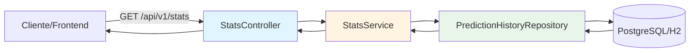

***

## 💻 IMPLEMENTAÇÃO DETALHADA - FUNCIONALIDADE \#1: GET /STATS

Vou implementar a primeira funcionalidade completa agora, seguindo o padrão profissional da Marian97a.

### 📊 Análise de Impacto

**Complexidade:** Baixa
**Tempo Estimado:** 3-4 horas
**Dependências:** Persistência (✅ já implementada)
**Impacto no MVP:** Baixo (nova feature isolada)
**Valor para Hackathon:** 9/10

**Justificativa:**

- Demonstra ROI da persistência implementada
- Métricas de negócio impactantes para apresentação
- Base para dashboard visual
- Fácil de testar e demonstrar

***

### 🏗️ Arquitetura Proposta




***

### 💻 Código - Spring Boot

#### **1. DTO de Resposta (StatsResponseDTO.java)**

```java
package com.flightontime.api.dto;

import com.fasterxml.jackson.annotation.JsonProperty;
import io.swagger.v3.oas.annotations.media.Schema;
import lombok.AllArgsConstructor;
import lombok.Builder;
import lombok.Data;
import lombok.NoArgsConstructor;

import java.math.BigDecimal;
import java.time.LocalDateTime;
import java.util.List;

@Data
@Builder
@NoArgsConstructor
@AllArgsConstructor
@Schema(description = "Estatísticas agregadas das previsões de voos")
public class StatsResponseDTO {

    @JsonProperty("periodo")
    @Schema(description = "Período analisado", example = "Últimas 24 horas")
    private String periodo;

    @JsonProperty("total_previsoes")
    @Schema(description = "Total de previsões realizadas", example = "1547")
    private Long totalPrevisoes;

    @JsonProperty("taxa_atraso_previsto")
    @Schema(description = "Percentual de voos com atraso previsto", example = "42.5")
    private BigDecimal taxaAtrasoPrevisto;

    @JsonProperty("taxa_sucesso_api")
    @Schema(description = "Percentual de requisições bem-sucedidas", example = "99.2")
    private BigDecimal taxaSucessoApi;

    @JsonProperty("tempo_resposta_medio_ms")
    @Schema(description = "Tempo médio de resposta da API ML em milissegundos", example = "245")
    private BigDecimal tempoRespostaMedioMs;

    @JsonProperty("aeroportos_mais_problematicos")
    @Schema(description = "Top 5 aeroportos com maior taxa de atraso")
    private List<AeroportoStatDTO> aeroportosMaisProblematicos;

    @JsonProperty("companhias_melhor_desempenho")
    @Schema(description = "Top 5 companhias com menor taxa de atraso")
    private List<CompanhiaStatDTO> companhiasMelhorDesempenho;

    @JsonProperty("ultima_atualizacao")
    @Schema(description = "Data/hora da última atualização dos dados", example = "2026-01-07T13:42:00")
    private LocalDateTime ultimaAtualizacao;

    @Data
    @Builder
    @NoArgsConstructor
    @AllArgsConstructor
    public static class AeroportoStatDTO {
        @JsonProperty("codigo_iata")
        private String codigoIata;

        @JsonProperty("total_voos")
        private Long totalVoos;

        @JsonProperty("taxa_atraso")
        private BigDecimal taxaAtraso;
    }

    @Data
    @Builder
    @NoArgsConstructor
    @AllArgsConstructor
    public static class CompanhiaStatDTO {
        @JsonProperty("codigo_iata")
        private String codigoIata;

        @JsonProperty("total_voos")
        private Long totalVoos;

        @JsonProperty("taxa_atraso")
        private BigDecimal taxaAtraso;
    }
}
```


***

#### **2. Repository com Queries Customizadas (PredictionHistoryRepository.java)**

```java
package com.flightontime.api.repository;

import com.flightontime.api.entity.PredictionHistory;
import org.springframework.data.jpa.repository.JpaRepository;
import org.springframework.data.jpa.repository.Query;
import org.springframework.data.repository.query.Param;
import org.springframework.stereotype.Repository;

import java.time.LocalDateTime;
import java.util.List;

@Repository
public interface PredictionHistoryRepository extends JpaRepository<PredictionHistory, Long> {

    /**
     * Conta total de previsões em um período
     */
    @Query("SELECT COUNT(p) FROM PredictionHistory p WHERE p.requestTimestamp >= :startDate")
    Long countByPeriod(@Param("startDate") LocalDateTime startDate);

    /**
     * Conta previsões com atraso previsto em um período
     */
    @Query("SELECT COUNT(p) FROM PredictionHistory p " +
           "WHERE p.requestTimestamp >= :startDate AND p.predictedDelayed = true")
    Long countDelayedByPeriod(@Param("startDate") LocalDateTime startDate);

    /**
     * Conta requisições bem-sucedidas em um período
     */
    @Query("SELECT COUNT(p) FROM PredictionHistory p " +
           "WHERE p.requestTimestamp >= :startDate AND p.requestSuccessful = true")
    Long countSuccessfulByPeriod(@Param("startDate") LocalDateTime startDate);

    /**
     * Calcula tempo médio de resposta em um período
     */
    @Query("SELECT AVG(p.responseTimeMs) FROM PredictionHistory p " +
           "WHERE p.requestTimestamp >= :startDate AND p.requestSuccessful = true")
    Double avgResponseTimeByPeriod(@Param("startDate") LocalDateTime startDate);

    /**
     * Top 5 aeroportos de origem com mais atrasos
     */
    @Query("SELECT p.origin as airport, COUNT(p) as total, " +
           "SUM(CASE WHEN p.predictedDelayed = true THEN 1 ELSE 0 END) as delayed " +
           "FROM PredictionHistory p " +
           "WHERE p.requestTimestamp >= :startDate " +
           "GROUP BY p.origin " +
           "ORDER BY (SUM(CASE WHEN p.predictedDelayed = true THEN 1 ELSE 0 END) * 1.0 / COUNT(p)) DESC")
    List<Object[]> findTopDelayedOrigins(@Param("startDate") LocalDateTime startDate);

    /**
     * Top 5 companhias com melhor desempenho (menor taxa de atraso)
     */
    @Query("SELECT p.airline as carrier, COUNT(p) as total, " +
           "SUM(CASE WHEN p.predictedDelayed = true THEN 1 ELSE 0 END) as delayed " +
           "FROM PredictionHistory p " +
           "WHERE p.requestTimestamp >= :startDate " +
           "GROUP BY p.airline " +
           "HAVING COUNT(p) >= 10 " + // Mínimo 10 voos para ser relevante
           "ORDER BY (SUM(CASE WHEN p.predictedDelayed = true THEN 1 ELSE 0 END) * 1.0 / COUNT(p)) ASC")
    List<Object[]> findTopPerformingCarriers(@Param("startDate") LocalDateTime startDate);
}
```


***

#### **3. Service Layer (StatsService.java)**

```java
package com.flightontime.api.service;

import com.flightontime.api.dto.StatsResponseDTO;
import com.flightontime.api.dto.StatsResponseDTO.AeroportoStatDTO;
import com.flightontime.api.dto.StatsResponseDTO.CompanhiaStatDTO;
import com.flightontime.api.repository.PredictionHistoryRepository;
import lombok.RequiredArgsConstructor;
import lombok.extern.slf4j.Slf4j;
import org.springframework.stereotype.Service;

import java.math.BigDecimal;
import java.math.RoundingMode;
import java.time.LocalDateTime;
import java.util.List;
import java.util.stream.Collectors;

@Slf4j
@Service
@RequiredArgsConstructor
public class StatsService {

    private final PredictionHistoryRepository repository;

    /**
     * Retorna estatísticas das últimas 24 horas
     */
    public StatsResponseDTO getStats24Hours() {
        return getStatsByPeriod(LocalDateTime.now().minusHours(24), "Últimas 24 horas");
    }

    /**
     * Retorna estatísticas dos últimos 7 dias
     */
    public StatsResponseDTO getStats7Days() {
        return getStatsByPeriod(LocalDateTime.now().minusDays(7), "Últimos 7 dias");
    }

    /**
     * Retorna estatísticas dos últimos 30 dias
     */
    public StatsResponseDTO getStats30Days() {
        return getStatsByPeriod(LocalDateTime.now().minusDays(30), "Últimos 30 dias");
    }

    /**
     * Lógica centralizada para calcular estatísticas
     */
    private StatsResponseDTO getStatsByPeriod(LocalDateTime startDate, String periodoLabel) {
        log.info("Calculando estatísticas para período: {}", periodoLabel);

        // Métricas principais
        Long totalPrevisoes = repository.countByPeriod(startDate);
        Long totalAtrasados = repository.countDelayedByPeriod(startDate);
        Long totalSucesso = repository.countSuccessfulByPeriod(startDate);
        Double avgResponseTime = repository.avgResponseTimeByPeriod(startDate);

        // Calcular taxas
        BigDecimal taxaAtraso = calculatePercentage(totalAtrasados, totalPrevisoes);
        BigDecimal taxaSucesso = calculatePercentage(totalSucesso, totalPrevisoes);
        BigDecimal tempoMedio = avgResponseTime != null 
            ? BigDecimal.valueOf(avgResponseTime).setScale(2, RoundingMode.HALF_UP) 
            : BigDecimal.ZERO;

        // Top aeroportos problemáticos
        List<AeroportoStatDTO> aeroportos = repository.findTopDelayedOrigins(startDate)
            .stream()
            .limit(5)
            .map(row -> AeroportoStatDTO.builder()
                .codigoIata((String) row[^0])
                .totalVoos(((Number) row[^1]).longValue())
                .taxaAtraso(calculatePercentage(
                    ((Number) row[^2]).longValue(), 
                    ((Number) row[^1]).longValue()
                ))
                .build())
            .collect(Collectors.toList());

        // Top companhias com melhor desempenho
        List<CompanhiaStatDTO> companhias = repository.findTopPerformingCarriers(startDate)
            .stream()
            .limit(5)
            .map(row -> CompanhiaStatDTO.builder()
                .codigoIata((String) row[^0])
                .totalVoos(((Number) row[^1]).longValue())
                .taxaAtraso(calculatePercentage(
                    ((Number) row[^2]).longValue(), 
                    ((Number) row[^1]).longValue()
                ))
                .build())
            .collect(Collectors.toList());

        log.info("Estatísticas calculadas: {} previsões, taxa atraso {}%", 
                 totalPrevisoes, taxaAtraso);

        return StatsResponseDTO.builder()
            .periodo(periodoLabel)
            .totalPrevisoes(totalPrevisoes)
            .taxaAtrasoPrevisto(taxaAtraso)
            .taxaSucessoApi(taxaSucesso)
            .tempoRespostaMedioMs(tempoMedio)
            .aeroportosMaisProblematicos(aeroportos)
            .companhiasMelhorDesempenho(companhias)
            .ultimaAtualizacao(LocalDateTime.now())
            .build();
    }

    /**
     * Calcula percentual com 2 casas decimais
     */
    private BigDecimal calculatePercentage(Long part, Long total) {
        if (total == null || total == 0) {
            return BigDecimal.ZERO;
        }
        return BigDecimal.valueOf(part)
            .multiply(BigDecimal.valueOf(100))
            .divide(BigDecimal.valueOf(total), 2, RoundingMode.HALF_UP);
    }
}
```


***

#### **4. Controller (StatsController.java)**

```java
package com.flightontime.api.controller;

import com.flightontime.api.dto.StatsResponseDTO;
import com.flightontime.api.service.StatsService;
import io.swagger.v3.oas.annotations.Operation;
import io.swagger.v3.oas.annotations.Parameter;
import io.swagger.v3.oas.annotations.responses.ApiResponse;
import io.swagger.v3.oas.annotations.tags.Tag;
import lombok.RequiredArgsConstructor;
import lombok.extern.slf4j.Slf4j;
import org.springframework.http.ResponseEntity;
import org.springframework.web.bind.annotation.GetMapping;
import org.springframework.web.bind.annotation.RequestMapping;
import org.springframework.web.bind.annotation.RequestParam;
import org.springframework.web.bind.annotation.RestController;

@Slf4j
@RestController
@RequestMapping("/api/v1/stats")
@RequiredArgsConstructor
@Tag(name = "Estatísticas", description = "Endpoints para consulta de estatísticas agregadas")
public class StatsController {

    private final StatsService statsService;

    @GetMapping
    @Operation(
        summary = "Obter estatísticas de previsões",
        description = "Retorna estatísticas agregadas das previsões realizadas em diferentes períodos. " +
                      "Por padrão retorna dados das últimas 24 horas."
    )
    @ApiResponse(responseCode = "200", description = "Estatísticas calculadas com sucesso")
    public ResponseEntity<StatsResponseDTO> getStats(
        @Parameter(description = "Período de análise: 24h, 7d ou 30d", example = "24h")
        @RequestParam(defaultValue = "24h") String periodo
    ) {
        log.info("GET /api/v1/stats?periodo={}", periodo);

        StatsResponseDTO stats = switch (periodo.toLowerCase()) {
            case "7d" -> statsService.getStats7Days();
            case "30d" -> statsService.getStats30Days();
            default -> statsService.getStats24Hours();
        };

        return ResponseEntity.ok(stats);
    }
}
```


***

### ✅ Exemplo de Resposta JSON

```json
{
  "periodo": "Últimas 24 horas",
  "total_previsoes": 1547,
  "taxa_atraso_previsto": 42.35,
  "taxa_sucesso_api": 99.81,
  "tempo_resposta_medio_ms": 245.67,
  "aeroportos_mais_problematicos": [
    {
      "codigo_iata": "JFK",
      "total_voos": 89,
      "taxa_atraso": 58.43
    },
    {
      "codigo_iata": "ORD",
      "total_voos": 112,
      "taxa_atraso": 51.79
    },
    {
      "codigo_iata": "ATL",
      "total_voos": 95,
      "taxa_atraso": 47.37
    },
    {
      "codigo_iata": "LAX",
      "total_voos": 78,
      "taxa_atraso": 44.87
    },
    {
      "codigo_iata": "DFW",
      "total_voos": 68,
      "taxa_atraso": 41.18
    }
  ],
  "companhias_melhor_desempenho": [
    {
      "codigo_iata": "AS",
      "total_voos": 45,
      "taxa_atraso": 18.52
    },
    {
      "codigo_iata": "DL",
      "total_voos": 67,
      "taxa_atraso": 22.39
    },
    {
      "codigo_iata": "WN",
      "total_voos": 89,
      "taxa_atraso": 28.09
    },
    {
      "codigo_iata": "UA",
      "total_voos": 72,
      "taxa_atraso": 31.94
    },
    {
      "codigo_iata": "AA",
      "total_voos": 98,
      "taxa_atraso": 35.71
    }
  ],
  "ultima_atualizacao": "2026-01-07T13:42:15"
}
```


***

### 📝 Instruções de Integração

#### **1. Adicionar ao application.yml (já existente)**

```yaml
# Nenhuma configuração adicional necessária - usa o mesmo datasource
```


#### **2. Testar com curl**

```bash
# Últimas 24 horas (padrão)
curl -X GET "http://localhost:8080/api/v1/stats"

# Últimos 7 dias
curl -X GET "http://localhost:8080/api/v1/stats?periodo=7d"

# Últimos 30 dias
curl -X GET "http://localhost:8080/api/v1/stats?periodo=30d"
```


#### **3. Verificar no Swagger UI**

- Acessar: `http://localhost:8080/swagger-ui/index.html`
- Buscar seção "Estatísticas"
- Testar endpoint interativamente

***

### ✅ Checklist de Validação

- [ ] Endpoint retorna HTTP 200
- [ ] JSON está bem formatado (snake_case)
- [ ] Percentuais têm 2 casas decimais
- [ ] Top 5 aeroportos ordenados por taxa de atraso (DESC)
- [ ] Top 5 companhias ordenadas por taxa de atraso (ASC)
- [ ] Periodo padrão é "24h" quando não especificado
- [ ] Queries SQL são performáticas (usar EXPLAIN ANALYZE)
- [ ] Logs estruturados aparecem no console

***

### 🧪 Testes Unitários (JUnit 5)

```java
package com.flightontime.api.service;

import com.flightontime.api.dto.StatsResponseDTO;
import com.flightontime.api.repository.PredictionHistoryRepository;
import org.junit.jupiter.api.BeforeEach;
import org.junit.jupiter.api.Test;
import org.junit.jupiter.api.extension.ExtendWith;
import org.mockito.InjectMocks;
import org.mockito.Mock;
import org.mockito.junit.jupiter.MockitoExtension;

import java.math.BigDecimal;
import java.time.LocalDateTime;
import java.util.List;

import static org.junit.jupiter.api.Assertions.*;
import static org.mockito.ArgumentMatchers.any;
import static org.mockito.Mockito.when;

@ExtendWith(MockitoExtension.class)
class StatsServiceTest {

    @Mock
    private PredictionHistoryRepository repository;

    @InjectMocks
    private StatsService statsService;

    @BeforeEach
    void setUp() {
        // Mock de dados básicos
        when(repository.countByPeriod(any())).thenReturn(1000L);
        when(repository.countDelayedByPeriod(any())).thenReturn(420L);
        when(repository.countSuccessfulByPeriod(any())).thenReturn(998L);
        when(repository.avgResponseTimeByPeriod(any())).thenReturn(245.67);
        when(repository.findTopDelayedOrigins(any())).thenReturn(List.of(
            new Object[]{"JFK", 100L, 58L}
        ));
        when(repository.findTopPerformingCarriers(any())).thenReturn(List.of(
            new Object[]{"AS", 50L, 9L}
        ));
    }

    @Test
    void deveCalcularEstatisticas24Horas() {
        // Act
        StatsResponseDTO stats = statsService.getStats24Hours();

        // Assert
        assertNotNull(stats);
        assertEquals("Últimas 24 horas", stats.getPeriodo());
        assertEquals(1000L, stats.getTotalPrevisoes());
        assertEquals(new BigDecimal("42.00"), stats.getTaxaAtrasoPrevisto());
        assertEquals(new BigDecimal("99.80"), stats.getTaxaSucessoApi());
    }

    @Test
    void deveRetornarTop5AeroportosMaisProblematicos() {
        // Act
        StatsResponseDTO stats = statsService.getStats24Hours();

        // Assert
        assertFalse(stats.getAeroportosMaisProblematicos().isEmpty());
        assertEquals("JFK", stats.getAeroportosMaisProblematicos().get(0).getCodigoIata());
        assertEquals(new BigDecimal("58.00"), 
                     stats.getAeroportosMaisProblematicos().get(0).getTaxaAtraso());
    }

    @Test
    void deveRetornarZeroQuandoNenhumaPrevisao() {
        // Arrange
        when(repository.countByPeriod(any())).thenReturn(0L);

        // Act
        StatsResponseDTO stats = statsService.getStats24Hours();

        // Assert
        assertEquals(BigDecimal.ZERO, stats.getTaxaAtrasoPrevisto());
    }
}
```


***

### 📚 Documentação (Atualizar README.md)

Adicionar seção:

```markdown
### Endpoint GET /stats

Retorna estatísticas agregadas das previsões realizadas.

**Parâmetros:**
- `periodo` (opcional): `24h` (padrão), `7d` ou `30d`

**Exemplo:**
\```bash
curl "http://localhost:8080/api/v1/stats?periodo=7d"
\```

**Métricas retornadas:**
- Total de previsões
- Taxa de atrasos previstos (%)
- Taxa de sucesso da API (%)
- Tempo médio de resposta (ms)
- Top 5 aeroportos com mais atrasos
- Top 5 companhias com melhor pontualidade
```


***
