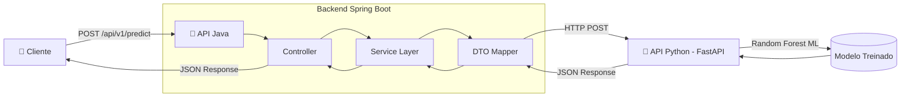

# FlightOnTime API - Backend Service ✈️


---

## 📋 Sobre o Projeto

O **FlightOnTime API** é uma API REST de alta performance focada em **inferência preditiva em tempo real** para atrasos de voos. A aplicação atua como camada de orquestração entre o cliente (Front-end/Mobile) e o serviço de Machine Learning (Python/FastAPI), processando requisições, validando dados e formatando respostas de forma padronizada.

### 🎯 Decisão Arquitetural: Stateless (Sem Banco de Dados)

A arquitetura foi deliberadamente projetada como **Stateless** para o MVP. Esta decisão técnica se fundamenta em:

| Princípio                            | Benefício                                                                       |
| ------------------------------------ | ------------------------------------------------------------------------------- |
| **Baixa Latência**                   | Sem overhead de I/O de banco, a API processa requisições em milissegundos       |
| **Escalabilidade Horizontal**        | Qualquer instância pode processar qualquer requisição sem dependência de estado |
| **Simplicidade Operacional (YAGNI)** | Menor superfície de ataque, menos pontos de falha, deploy simplificado          |
| **Foco no Core**                     | 100% dos recursos dedicados à inferência preditiva, não à persistência          |

> **Nota:** A infraestrutura de banco (PostgreSQL/Flyway) está pré-configurada para evolução futura (logs de auditoria, persistência de predições), mas não é utilizada no fluxo crítico do MVP.

---

## 🏗️ Arquitetura da Solução

### Diagrama de Fluxo



### Design Patterns Implementados

| Pattern                  | Implementação                                                                          | Propósito                                               |
| ------------------------ | -------------------------------------------------------------------------------------- | ------------------------------------------------------- |
| **DTO Pattern**          | `PredictionRequest`, `PredictionResponse`, `DataScienceRequest`, `DataScienceResponse` | Desacopla representação de dados entre camadas e APIs   |
| **Service Layer**        | `FlightPredictionService`                                                              | Centraliza lógica de negócio e orquestração             |
| **Dependency Injection** | Spring IoC Container                                                                   | Inversão de controle e baixo acoplamento                |
| **Adapter**              | Mapeamento interno no Service                                                          | Converte formato Frontend → Modelo ML (ex: KM → Milhas) |

---

## 📡 Endpoints (Documentação da API)

### Base URL

```
http://localhost:8080/api/v1
```

### 1. Predição de Atraso

**`POST /api/v1/predict`**

Realiza a inferência preditiva consumindo o modelo de Machine Learning.

#### Request Body

```json
{
  "companhia": "LATAM",
  "origem_aeroporto": "GRU",
  "destino_aeroporto": "GIG",
  "data_partida": "2026-01-15T14:30:00",
  "distancia_km": 450.0
}
```

| Campo               | Tipo       | Validação              | Descrição                           |
| ------------------- | ---------- | ---------------------- | ----------------------------------- |
| `companhia`         | `string`   | `@NotBlank`            | Nome ou código da companhia aérea   |
| `origem_aeroporto`  | `string`   | `@Pattern(^[A-Z]{3}$)` | Código IATA do aeroporto de origem  |
| `destino_aeroporto` | `string`   | `@Pattern(^[A-Z]{3}$)` | Código IATA do aeroporto de destino |
| `data_partida`      | `datetime` | `@NotNull`             | Data e hora da partida (ISO 8601)   |
| `distancia_km`      | `number`   | `@Positive`            | Distância do voo em quilômetros     |

#### Response Body (Sucesso - 200 OK)

```json
{
  "predicao": 1,
  "probabilidade": 0.73,
  "mensagem": "Alta probabilidade de atraso. Considere chegar mais cedo.",
  "metricas_internas": {
    "risco_historico_origem": 0.45,
    "risco_historico_companhia": 0.32,
    "fonte": "random_forest_v2.1"
  }
}
```

| Campo                                         | Tipo      | Descrição                                 |
| --------------------------------------------- | --------- | ----------------------------------------- |
| `predicao`                                    | `integer` | `0` = Pontual, `1` = Atraso Previsto      |
| `probabilidade`                               | `number`  | Confiança da predição (0.0 a 1.0)         |
| `mensagem`                                    | `string`  | Recomendação prescritiva para o usuário   |
| `metricas_internas`                           | `object`  | Dados para monitoramento de Concept Drift |
| `metricas_internas.risco_historico_origem`    | `number`  | Risco histórico do aeroporto de origem    |
| `metricas_internas.risco_historico_companhia` | `number`  | Risco histórico da companhia aérea        |
| `metricas_internas.fonte`                     | `string`  | Versão do modelo utilizado                |

---

### 2. Health Check

**`GET /api/v1/health`**

Endpoint para verificação de saúde da aplicação (readiness probe).

#### Response (200 OK)

```
FlightOnTime API (MVP Backend) - Online ✈️
```

---

### 3. Documentação Interativa (Swagger UI)

**`GET /swagger-ui.html`**

Interface interativa para explorar e testar a API.

---

## 🚀 Guia de Instalação e Execução

### Pré-requisitos

- **Java 17+** (OpenJDK ou Oracle JDK)
- **Maven 3.9+**
- **API Python em execução** (porta 8000)

### Instalação Rápida

```bash
# 1. Clone o repositório
git clone https://github.com/seu-usuario/flightontime-api.git
cd flightontime-api

# 2. Compile o projeto
mvn clean install -DskipTests

# 3. Execute a aplicação
mvn spring-boot:run
```

### Configuração de Variáveis de Ambiente

A URL da API de Machine Learning deve ser configurada. Existem duas opções:

**Opção 1: Via `application.properties`**

```properties
ml.api.base-url=http://127.0.0.1:8000
```

**Opção 2: Via Variável de Ambiente**

```bash
# Windows (PowerShell)
$env:ML_API_BASE_URL="http://sua-api-python:8000"

# Linux/Mac
export ML_API_BASE_URL=http://sua-api-python:8000
```

### Verificação

```bash
# Health Check
curl http://localhost:8080/api/v1/health

# Teste de Predição
curl -X POST http://localhost:8080/api/v1/predict \
  -H "Content-Type: application/json" \
  -d '{"companhia":"GOL","origem_aeroporto":"GRU","destino_aeroporto":"CGH","data_partida":"2026-01-20T10:00:00","distancia_km":30}'
```

---

## 🔧 Decisões Técnicas (Diferenciais)

### 1. Integração com API Python via RestTemplate

A comunicação com o serviço de ML é feita através do `RestTemplate` configurado em `RestTemplateConfig`. Esta escolha garante:

- **Simplicidade**: Configuração mínima para comunicação síncrona
- **Suporte a JSON não-padrão**: Parser configurado com `JsonReadFeature.ALLOW_NON_NUMERIC_NUMBERS` para tratar valores como `NaN`
- **Extensibilidade**: Pronto para evolução para `WebClient` (reativo) se necessário

```java
@Bean
public RestTemplate restTemplate() {
    return new RestTemplate();
}
```

### 2. Validação Robusta com Jakarta Validation

Todos os dados de entrada são validados antes do processamento:

```java
@NotBlank(message = "Companhia é obrigatória")
private String companhia;

@Pattern(regexp = "^[A-Z]{3}$", message = "Código IATA deve ter 3 letras")
private String origemAeroporto;

@Positive(message = "Distância deve ser positiva")
private Double distanciaKm;
```

A API retorna erros estruturados (HTTP 400) com mensagens claras para o consumidor.

### 3. Conversões Inteligentes (Adapter Pattern)

O `FlightPredictionService` realiza transformações críticas entre formatos:

| Input (Frontend)     | Output (Modelo ML) | Lógica                            |
| -------------------- | ------------------ | --------------------------------- |
| `"LATAM"`            | `"LA"`             | Mapeamento de código IATA         |
| `distanciaKm: 450`   | `distance: 279.6`  | Conversão KM → Milhas (×0.621371) |
| `dataPartida: 14:30` | `crsDepTime: 1430` | Formato HHMM do modelo            |

### 4. Preparação para Concept Drift

O campo `metricas_internas` na resposta permite ao time de Data Science monitorar a performance do modelo em produção:

- **`risco_historico_origem`**: Baseline de atrasos do aeroporto
- **`risco_historico_companhia`**: Baseline de atrasos da companhia
- **`fonte`**: Versionamento do modelo para A/B testing

Esta arquitetura permite identificar degradação do modelo sem modificar o front-end.

---

## 🛣️ Roadmap (Próximos Passos)

### Curto Prazo (v1.1)

- [ ] **Cache com Redis**: Implementar cache para rotas frequentes (ex: GRU→GIG), reduzindo latência em ~80%
- [ ] **Circuit Breaker**: Adicionar Resilience4j para fallback gracioso quando a API Python estiver indisponível

### Médio Prazo (v2.0)

- [ ] **Autenticação OAuth2/JWT**: Habilitar clientes corporativos com rate limiting por tier
- [ ] **Métricas Prometheus**: Expor métricas de latência, throughput e taxa de erro

### Longo Prazo (v3.0)

- [ ] **Arquitetura Assíncrona (Kafka)**: Persistência de logs de predição sem impactar latência da API
- [ ] **Multi-modelo**: Suporte a múltiplos modelos (Random Forest, XGBoost, Neural Network) com routing inteligente

---

## 📁 Estrutura do Projeto

```
src/main/java/com/flightontime/flightontime/
├── api/
│   ├── controller/          # Endpoints REST
│   │   └── PredictController.java
│   ├── dto/
│   │   ├── request/         # DTOs de entrada
│   │   │   ├── PredictionRequest.java
│   │   │   └── DataScienceRequest.java
│   │   └── response/        # DTOs de saída
│   │       ├── PredictionResponse.java
│   │       └── DataScienceResponse.java
│   └── validation/          # Validadores customizados
├── client/
│   └── RestTemplateConfig.java   # Configuração HTTP Client
├── config/                  # Configurações Spring
├── domain/
│   ├── service/             # Lógica de negócio
│   │   └── FlightPredictionService.java
│   ├── model/               # Entidades (preparado para persistência)
│   └── repository/          # Repositórios JPA
└── FlightontimeApplication.java  # Classe principal
```

---

## 🤝 Contribuição

1. Fork o projeto
2. Crie sua feature branch (`git checkout -b feature/nova-funcionalidade`)
3. Commit suas mudanças (`git commit -m 'feat: adiciona nova funcionalidade'`)
4. Push para a branch (`git push origin feature/nova-funcionalidade`)
5. Abra um Pull Request

---

## 📝 Licença

Este projeto foi desenvolvido para o Hackathon NoDelayFlight.

---

<div align="center">

**Desenvolvido com ☕ e ✈️ pela Equipe FlightOnTime**

</div>
