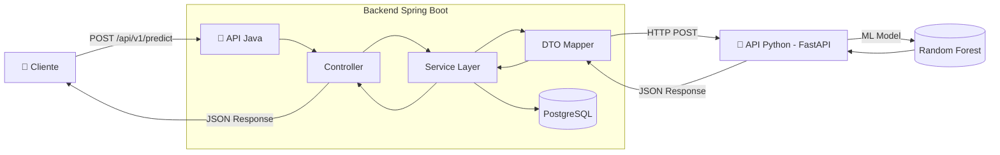

# FlightOnTime API - Backend Service ✈️


---

## 📋 Sobre o Projeto

O **FlightOnTime API** é uma API REST de alta performance focada em **inferência preditiva em tempo real** para atrasos de voos. A aplicação atua como camada de orquestração entre o cliente (Front-end/Mobile) e o serviço de Machine Learning (Python/FastAPI), processando requisições, validando dados e persistindo o histórico de predições.

### 🎯 Arquitetura de Persistência

Diferente do MVP inicial, a versão atual implementa persistência de dados para auditoria e melhoria contínua do modelo:

| Recurso | Descrição |
|---------|-----------|
| **PostgreSQL** | Banco de dados oficial para produção e desenvolvimento local (via Docker). |
| **H2 Database** | Banco de dados em memória utilizado exclusivamente para o escopo de **testes**, garantindo isolamento e performance. |
| **Flyway** | Gerenciamento de versionamento de banco de dados (Migrations). |
| **Constraint de Status** | O sistema agora suporta e valida os status: `No Horário`, `Atrasado`, `Cancelado` e `Pontual`. |

---

## 🏗️ Arquitetura da Solução

### Diagrama de Fluxo



### Design Patterns Implementados

| Pattern                  | Implementação                                                                          | Propósito                                               |
| ------------------------ | -------------------------------------------------------------------------------------- | ------------------------------------------------------- |
| **DTO Pattern**          | `PredictionRequest`, `PredictionResponse`, `DataScienceRequest`, `DataScienceResponse` | Desacopla representação de dados entre camadas e APIs   |
| **Service Layer**        | `FlightPredictionService`                                                              | Centraliza lógica de negócio e orquestração             |
| **Dependency Injection** | Spring IoC Container                                                                   | Inversão de controle e baixo acoplamento                |
| **Adapter**              | Mapeamento interno no Service                                                          | Converte formato Frontend → Modelo ML (ex: KM → Milhas) |

---

## 🧪 Testes Automatizados

O projeto utiliza uma estratégia de testes em pirâmide para garantir a confiabilidade das predições.

### Como Executar os Testes

```bash
# Executa todos os testes (Unitários e de Integração)
mvn test
```

### Estrutura de Testes

1.  **Testes Unitários (Services):** Implementados com **JUnit 5** e **Mockito**. Isolam a lógica de negócio, mockando o `RestTemplate` e o `PredictionHistoryRepository`.
2.  **Testes de Integração (Controllers):** Utilizam **MockMvc** e **H2 Database**. Simulam o fluxo completo de uma requisição REST, validando a persistência real no banco de dados em memória.
3.  **Ambiente Isolado:** O arquivo `src/test/resources/application-test.properties` garante que os testes não interfiram nos dados do PostgreSQL local/produção.

---

## 📡 Endpoints (Documentação da API)

### Base URL
```
http://localhost:8080/api/v1
```

### 1. Predição de Atraso

**`POST /api/v1/predict`**

Realiza a inferência preditiva consumindo o modelo de Machine Learning.

#### Request Body

```json
{
  "companhia": "LATAM",
  "origem_aeroporto": "GRU",
  "destino_aeroporto": "JFK",
  "data_partida": "2026-01-15T14:30:00",
  "distancia_km": 7600.0
}
```

| Campo               | Tipo       | Validação              | Descrição                           |
| ------------------- | ---------- | ---------------------- | ----------------------------------- |
| `companhia`         | `string`   | `@NotBlank`            | Nome ou código da companhia aérea   |
| `origem_aeroporto`  | `string`   | `@Pattern(^[A-Z]{3}$)` | Código IATA do aeroporto de origem  |
| `destino_aeroporto` | `string`   | `@Pattern(^[A-Z]{3}$)` | Código IATA do aeroporto de destino |
| `data_partida`      | `datetime` | `@NotNull`             | Data e hora da partida (ISO 8601)   |
| `distancia_km`      | `number`   | `@Positive`            | Distância do voo em quilômetros     |

#### Response Body (200 OK)

```json
{
  "predicao": 0,
  "probabilidade": 0.05,
  "mensagem": "Voo com alta probabilidade de ser Pontual.",
  "explicacoes": ["Horário favorável", "Histórico positivo da companhia"]
}
```

| Campo           | Tipo      | Descrição                                 |
| --------------- | --------- | ----------------------------------------- |
| `predicao`      | `integer` | `0` = Pontual, `1` = Atraso Previsto      |
| `probabilidade` | `number`  | Confiança da predição (0.0 a 1.0)         |
| `mensagem`      | `string`  | Recomendação prescritiva para o usuário   |
| `explicacoes`   | `array`   | Fatores que contribuíram para a predição  |

---

### 2. Health Check

**`GET /api/v1/health`**

Endpoint para verificação de saúde da aplicação (readiness probe).

#### Response (200 OK)

```
FlightOnTime API (MVP Backend) - Online ✈️
```

---

### 3. Documentação Interativa (Swagger UI)

**`GET /swagger-ui.html`**

Interface interativa para explorar e testar a API.

---

## 🚀 Guia de Instalação e Execução

### Pré-requisitos
- **Java 17+**
- **Maven 3.9+**
- **Docker & Docker Compose** (para o PostgreSQL)

### Instalação e Execução

```bash
# 1. Inicie a infraestrutura (PostgreSQL)
docker-compose up -d postgres-db

# 2. Compile e execute os testes
mvn clean test

# 3. Execute a aplicação
mvn spring-boot:run
```

### Configuração de Banco de Dados
A aplicação espera um PostgreSQL rodando em `localhost:5432` com as credenciais padrão:
- **DB:** `flightontime_db`
- **User/Pass:** `postgres/postgres`

*Nota: Ao rodar os testes via `mvn test`, o Spring ativará automaticamente o perfil `test`, utilizando o **H2 In-memory**.*

---

## 🔧 Decisões Técnicas (Diferenciais)

### 1. Integração com API Python via RestTemplate

A comunicação com o serviço de ML é feita através do `RestTemplate` configurado em `RestTemplateConfig`. Esta escolha garante:

- **Simplicidade**: Configuração mínima para comunicação síncrona
- **Suporte a JSON não-padrão**: Parser configurado com `JsonReadFeature.ALLOW_NON_NUMERIC_NUMBERS` para tratar valores como `NaN`
- **Extensibilidade**: Pronto para evolução para `WebClient` (reativo) se necessário

```java
@Bean
public RestTemplate restTemplate() {
    return new RestTemplate();
}
```

### 2. Validação Robusta com Jakarta Validation

Todos os dados de entrada são validados antes do processamento:

```java
@NotBlank(message = "Companhia é obrigatória")
private String companhia;

@Pattern(regexp = "^[A-Z]{3}$", message = "Código IATA deve ter 3 letras")
private String origemAeroporto;

@Positive(message = "Distância deve ser positiva")
private Double distanciaKm;
```

A API retorna erros estruturados (HTTP 400) com mensagens claras para o consumidor.

### 3. Conversões Inteligentes (Adapter Pattern)

O `FlightPredictionService` realiza transformações críticas entre formatos:

| Input (Frontend)     | Output (Modelo ML) | Lógica                            |
| -------------------- | ------------------ | --------------------------------- |
| `"LATAM"`            | `"LA"`             | Mapeamento de código IATA         |
| `distanciaKm: 450`   | `distance: 279.6`  | Conversão KM → Milhas (×0.621371) |
| `dataPartida: 14:30` | `crsDepTime: 1430` | Formato HHMM do modelo            |

---

## 🛣️ Roadmap (Próximos Passos)

### Curto Prazo (v1.1)

- [x] **Persistência de Histórico**: Armazenamento de predições no Postgres.
- [x] **Testes Automatizados**: JUnit 5, Mockito e H2 Integration.
- [ ] **Cache L1**: Redis para consultas idênticas em curto intervalo.
- [ ] **Circuit Breaker**: Resilience4j para fallback do serviço de ML.

### Médio Prazo (v2.0)

- [ ] **Autenticação OAuth2/JWT**: Habilitar clientes corporativos com rate limiting por tier
- [ ] **Métricas Prometheus**: Expor métricas de latência, throughput e taxa de erro

### Longo Prazo (v3.0)

- [ ] **Arquitetura Assíncrona (Kafka)**: Persistência de logs de predição sem impactar latência da API
- [ ] **Multi-modelo**: Suporte a múltiplos modelos (Random Forest, XGBoost, Neural Network) com routing inteligente

---

<div align="center">

**Desenvolvido com ☕ e ✈️ pela Equipe NoDelayFlight**

</div>
